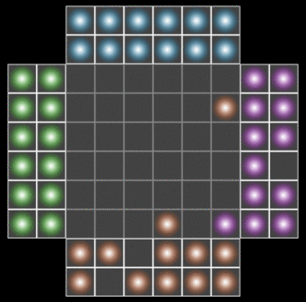

ORB
===

Orb is a simple Chinese Checkers game you can play on your computer with a friend. The rules are as follows:
* Each player controls two colors of orbs, which are facing eachother on the board.
* The goal of the game is to move all the orbs from one side of the board to the other using the least possible amount of turns.
* A player can only move one orb during his/her turn.
* Orbs can move by one step on the grid in any direction, including diagonally.
* Two orbs cannot occupy the same location, however they can "jump" over nearby orbs (regardless of the nearby orb's color):




Building
--------

The game requires the SFLM2 and Freetype libraries, and is cross platform (at least Windows and Linux were tested). To compile the program, use CMake:
```bash
mkdir build
cd build
cmake ../
make
```

The executable will be produced in the ```bin``` folder.


History
-------

The first playable version of this game was released on March 2010. The version on this github repository was updated to compile against SFML2 (the original version used SFML1), and to remove the dependency on the Frost game engine for utility classes and functions.
